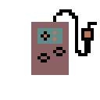

# Polyglottal
C++ exploring retro games.  Makes use of SFML library.

To get started, clone the repository and navigate to Project1.exe.

Double click to run.

Currently only built for windows.

Retro Drive!

Navigate your car around the track. Fuel depletes quickly, be careful not to run too low!

Fill up by driving to the fuel pump at the bottom of the map.

